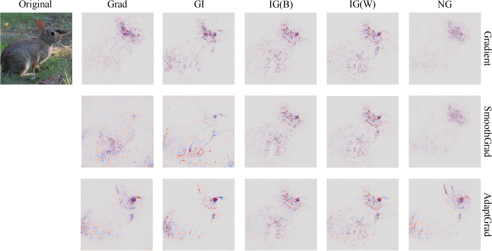

# AdaptGrad

Official implementation of the paper **"AdaptGrad: Adaptive Sampling to Reduce Noise"**, accepted at **NeurIPS 2025**.



## Overview

SmoothGrad reduces visual noise in gradient-based saliency maps by averaging gradients over noisy samples, but uses a **fixed noise magnitude** (`alpha`) that does not adapt to the input data range. AdaptGrad introduces an **adaptive sampling strategy** that adjusts the perturbation variance based on the confidence interval of the input, producing sharper and more faithful attributions without manual tuning.

## Project Structure

```
AdaptGrad/
├── core.py                  # Abstract base classes: GPU, Gradient, Bound, Sigma, Mask, Baseline
├── saliency.py              # Concrete saliency methods (Vanilla, SmoothGrad, NoiseGrad, IG, GxI)
├── utils.py                 # Visualization, data conversion, seed utilities
├── models/
│   ├── __init__.py          # Exports: create_model, list_models, MLP
│   ├── factory.py           # Unified model factory for torchvision models
│   └── MLP.py               # Simple MLP for MNIST experiments
├── metrics/
│   ├── consistency.py       # Rank correlation, layer randomization, scaling
│   ├── sparseness.py        # Gini coefficient
│   └── pic.py               # Performance Information Curve (from XRAI)
├── experiments/
│   ├── get_salience_mnist.py      # Generate saliency maps for MNIST
│   ├── get_salience_imagenet.py   # Generate saliency maps for ImageNet
│   ├── get_correlation.py         # Compute consistency / invariance metrics
│   ├── get_sparseness.py          # Compute sparseness (Gini) metrics
│   └── get_if.py                  # Compute Information Level (PIC) metrics
├── data/                    # Datasets (gitignored except samples)
├── saved_models/            # Pre-trained MLP weights
├── figs/                    # Figures for README
└── vis_imagenet.ipynb       # Visualization notebook
```

## Architecture

The codebase follows a **Strategy pattern** with composable abstract base classes:

| Class | Role | Implementations |
|---|---|---|
| `Gradient` | Computes gradients w.r.t. input | `VanillaGradient`, `SmoothGradient`, `NoiseGradient`, `IntegratedGradient`, `GradientxInput` |
| `Mask` | Generates noise masks | `GaussianMask` |
| `Sigma` | Controls noise magnitude | `FixedSigma`, `AdaptedGaussianSigma` |
| `Bound` | Defines input value range | `FixedBound`, `AdaptedBound` |
| `Baseline` | Defines baseline for IG | `WhiteBaseline`, `BlackBaseline` |

Components are **composable** -- you can plug any `Sigma` into any `Mask`, any `Mask` into `SmoothGradient`, and any `Gradient` into `IntegratedGradient` or `NoiseGradient`:

```python
from saliency import (
    SmoothGradient, GaussianMask, AdaptedGaussianSigma, AdaptedBound,
    IntegratedGradient, VanillaGradient, WhiteBaseline,
)

# AdaptGrad: adaptive noise sampling
adapted_bound = AdaptedBound(lower=-2.117904, upper=2.640000)
adapted_sigma = AdaptedGaussianSigma(alpha=0.95, bound=adapted_bound)
adapted_mask = GaussianMask(sigma=adapted_sigma)
adaptgrad = SmoothGradient(mask=adapted_mask, n_samples=50)

# SmoothGrad: fixed noise sampling (for comparison)
from saliency import FixedSigma, FixedBound
fixed_bound = FixedBound(lower=-2.117904, upper=2.640000)
fixed_sigma = FixedSigma(alpha=0.2, bound=fixed_bound)
fixed_mask = GaussianMask(sigma=fixed_sigma)
smoothgrad = SmoothGradient(mask=fixed_mask, n_samples=50)

# Integrated Gradient with adaptive backbone
ig_adapt = IntegratedGradient(
    baseline=WhiteBaseline(),
    backgrad=SmoothGradient(adapted_mask, n_samples=50),
    n_steps=50,
)
```

## Installation

```shell
pip install -r requirements.txt
```

**Dependencies:** PyTorch, torchvision, NumPy, SciPy, Matplotlib, Seaborn, Sacred, tqdm, joblib, Pillow

## Datasets

**MNIST** -- downloaded automatically via torchvision.

**ImageNet** -- download from [image-net.org](http://www.image-net.org/challenges/LSVRC/2012/) and place images in `./data/imagenet/images/`.

## Pre-trained Models

**MNIST:** Pre-trained MLP weights are provided in `saved_models/` (`mlp.pth`, `bias_mlp.pth`, `random_mlp.pth`).

**ImageNet:** Uses torchvision pre-trained weights via the unified model factory:

```python
from models import create_model

model = create_model("resnet50")             # load with default pretrained weights
logits = model(model.transform(img))         # returns raw logits
probs = logits.softmax(dim=1)                # apply softmax when needed
```

Supported models: `vgg11`, `vgg13`, `vgg16`, `vgg19`, `resnet50`, `resnet101`, `resnet152`, `inception_v3`, `mobilenet_v3_small`, `mobilenet_v3_large`, `densenet121`, `densenet169`, `densenet201`

## Experiments

The experiments use [Sacred](https://github.com/IDSIA/sacred) for configuration management.

### 1. Generate Saliency Maps

**MNIST** (Normal / Random labels / Bias shift):

```shell
python experiments/get_salience_mnist.py with model_name=MLP kind=Normal
python experiments/get_salience_mnist.py with model_name=MLP kind=Random
python experiments/get_salience_mnist.py with model_name=MLP kind=Bias device_id=0
```

**ImageNet:**

```shell
python experiments/get_salience_imagenet.py with model_name=vgg16
python experiments/get_salience_imagenet.py with model_name=resnet50
```

### 2. Consistency & Invariance

Compute rank correlation between saliency maps from normal vs. random/bias models:

```shell
python experiments/get_correlation.py -d MNIST -m MLP -s noabs
python experiments/get_correlation.py -d MNIST -m MLP -s abs
```

### 3. Sparseness

Compute Gini coefficient of saliency maps:

```shell
python experiments/get_sparseness.py -m vgg16
```

### 4. Information Level

Compute Performance Information Curve (PIC) metric:

```shell
python experiments/get_if.py -m vgg16
```

## Evaluation Metrics

| Metric | Script | Description |
|---|---|---|
| **Consistency** | `get_correlation.py` | Rank correlation (Spearman) between saliency maps from normal and random-label models |
| **Invariance** | `get_correlation.py` | Rank correlation between saliency maps from normal and bias-shifted models |
| **Sparseness** | `get_sparseness.py` | Gini coefficient measuring how concentrated the attribution is |
| **Information Level** | `get_if.py` | Performance Information Curve (PIC) from [XRAI](https://arxiv.org/abs/1906.02825), measuring how well saliency regions preserve model prediction |

## Results

All results are saved to the `./results/` directory.

## Citation

If you find this work useful, please cite:

```bibtex
@article{adaptgrad2025,
  title={AdaptGrad: Adaptive Sampling to Reduce Noise},
  author={},
  journal={Advances in Neural Information Processing Systems},
  year={2025}
}
```

## License

This project is licensed under the MIT License. See [LICENSE](LICENSE) for details.
